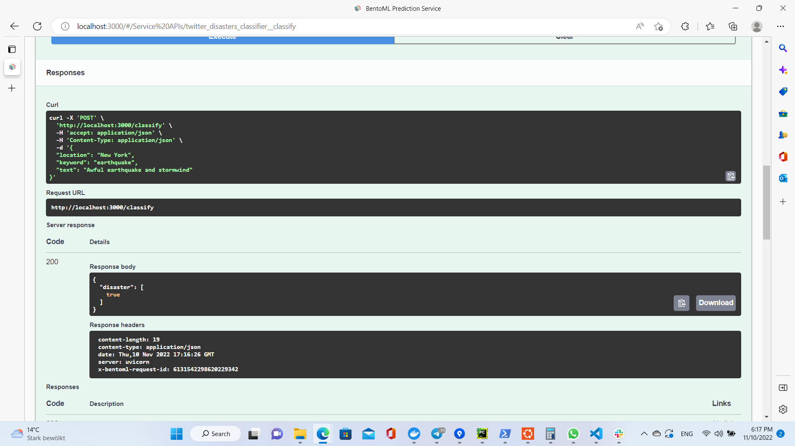
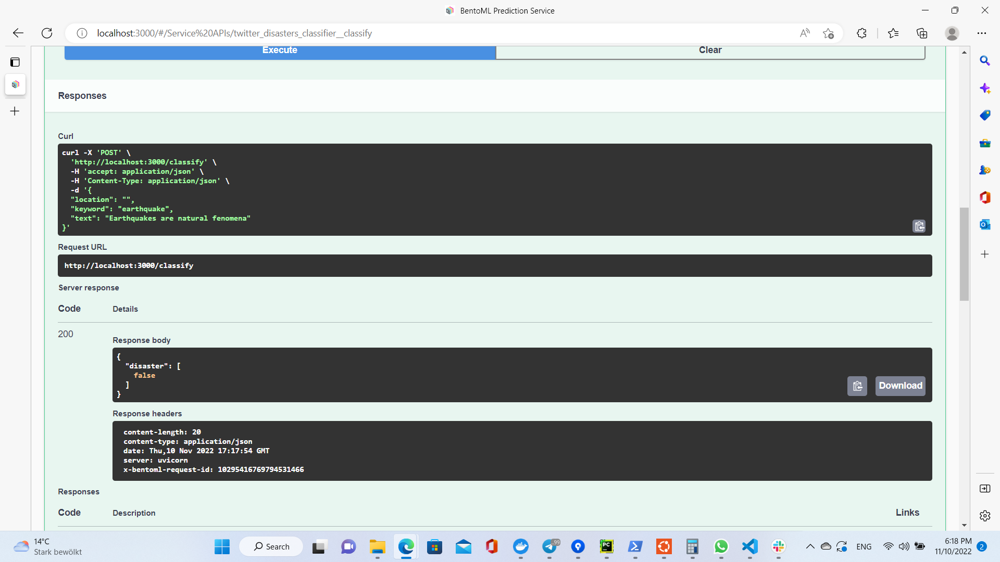

# Twitter Disaster Detection

## Problem statement
The goal of this project is to create a classifier, which, given a twit with some medatata, would classify it if it tells about a disaster or not.

The dataset is taken from an open Kaggle competition:
https://www.kaggle.com/competitions/nlp-getting-started

It's added to the project as `train.csv` file

## Main techniques used in the project

#### The problem belongs to the NLP domain, so the data we analyze here is purely textual. Here are some techniques that are used in the project:
1. `CountVectorizer`. This feature extraction works similarly to the `DictVectorizer`, but instead of vectorizing a category column it is applied to a column of texts. Each text is tokenized into separate words and for each word a feature is created with frequency of this word in a respective text
2. `PolynomialFeatures`. Since some words may influence the meaning of text only in combination with other words, the linear classifiers may loose some info. Creating polynomial features allows to find connections between word combinations and target
3. `SelectKBest`. After applying the previous two techniques we may end up with enormouse numbers of features, e.g. tens of thousands. This technique allows to select the most related to the target
4. `TruncatedSVD`. The final dimensionality reduction technique to reduce the number if features to hundreds
#### What and how was measured

1. 6 different models were tested:
   2. Naive Bayes
   3. Ridge Classifier
   3. Logistic Regression
   4. Decision Tree
   5. Random Forest
   6. XGBoost
7. `F1 score`. This metric was used to evaluate the performance of the models

## Research

* For the details please refer to the twitter_disasters.ipynb notebook

The research was done according to the following plan:
1. Data analysis and cleanup
2. Data preparation.
   3. Finding the most efficient data preparation steps for each model
      3. Result:

|                     | Preparation steps                        |
|:--------------------|:-----------------------------------------|
| Naive Bayes         | Keyword                                  |
| Ridge Classifier    | Stopwords + Stemming + Keyword           |
| Logistic Regression | Keyword + Location + Hashtags + Stemming |
| Tree                | Stopwords + URL Cleaner                  |
| Forest              | Keyword + URL Cleaner                    |
| XGBoost             | Keyword + Location + Hashtags + Stemming |

4. Data transformation.
   5. Trying different combinations of feature polynomialization and dimensionality reduction techniques.
      5. Result: no significant improvement of the score.
6. Final Hyperparameter tuning.

## Some results and conclusions

As a result the following scores were obtained for each step:

| Features                 |   Naive Bayes |   Ridge Classifier |   Logistic Regression |     Tree |   Forest |   XGBoost |
|:-------------------------|--------------:|-------------------:|----------------------:|---------:|---------:|----------:|
| Default (x_val)          |      0.733873 |           0.72186  |              0.734567 | 0.662804 | 0.700984 |  0.736132 |
| Default (test)           |      0.760383 |           0.758837 |              0.762422 | 0.669298 | 0.727909 |  0.742475 |
| Data preparation (x_val) |      0.748595 |           0.728327 |              0.744144 | 0.694677 | 0.729309 |  0.741877 |
| Data preparation (test)  |      0.773688 |           0.762805 |              0.767677 | 0.7017   | 0.740995 |  0.759367 |
| Fine tuning (x_val)      |      0.748595 |           0.746313 |              0.751787 | 0.72656  | 0.753157 |  0.746981 |
| Fine tuning (test)       |      0.773688 |           0.756972 |              0.773481 | 0.733781 | 0.772727 |  0.767213 |

- The Naive Bayes seems to work the best among the models on data like tweets
- The fact that all models, despite being tuned in different ways, converge to a similar mean score (~76-77%) in the end, might indicate that this value is close to the limit of the sentiment information this data contains 
  - This probably can be improved by bringing more information for example with pretrained embeddings
- The winner model - ComplementNB (Naive Bayes) - was selected to be trained and served

## How to run the project

- install requirements:
  - ```pip3 install -r requirements.txt```
- run notebook: 
  - `jupyter-lab`
- run tests locally:
  - `pytest`
- train and save model: 
  - `python train.py`
- run service locally:
  - `bentoml serve service.py:svc`
  - open http://localhost:3000 to access web UI for the API

## Examples of usage:


